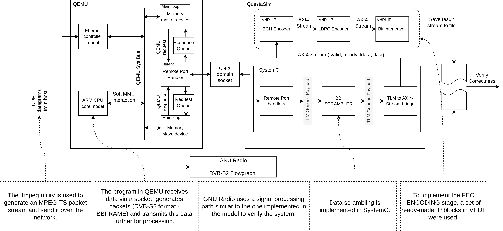

# Virtual model of a DVB-S2 video stream transmitter

**QEMU <-> SystemC <-> RTL co-simulation demo project**



## Project status

Everything works up to LDPC Encoder.  
The results after Bit Interleaver differ from GNU Radio.

## Required tools

- Linux based environment (everything was developed and tested on Ubuntu 22.04);
- QuestaSim (2021.2 was used);

## Build guide

#### Clone everything

```
git clone https://github.com/bombanya/dvbs2-cosim.git
cd dvbs2-cosim/
git submodule update --init

# do it separately so as not to load lots of QEMU submodules
git submodule update --init --recursive rtl-lib/
```

#### Build QEMU

```
# Install dependencies (most likely the list is not exhaustive)
sudo apt install libglib2.0-dev libgcrypt20-dev zlib1g-dev autoconf automake libtool bison flex libpixman-1-dev

cd xilinx-qemu
./configure --target-list="arm-softmmu,aarch64-softmmu" --enable-fdt --disable-kvm --disable-xen
make -j $(nproc)
cd ..
```

#### Build Linux kernel and rootfs with Buildroot

```
# copy buildroot and kernel configs
cp qemu-res/.buildroot.config buildroot/.config
cp qemu-res/xilinx_zynq_defconfig buildroot/

cd buildroot/
make -j $(nproc)
cd ..
```

#### Build Mode Adaptation stage program and add it to the rootfs for QEMU

```
# install cross-compiler if you don't have one
sudo apt-get install gcc-arm-linux-gnueabihf

cd qemu-res
mkdir root
arm-linux-gnueabihf-gcc mode_adapter_threaded.c -o root/mode_adapter_threaded -static -pthread
echo ./root/mode_adapter_threaded | cpio -H newc -o | gzip >> ../buildroot/output/images/rootfs.cpio.gz
cd ..
```

#### Compile device tree

```
# install dt compiler
sudo apt-get install device-tree-compiler

cd qemu-res
dtc -I dts -O dtb -o zynq-zc702-cosim.dtb zynq-zc702-cosim.dts 
cd ..
```

**Everything is prepared now to launch model**

## Model verification

### Launch model and feed it with MPEG-TS stream

#### First terminal for QEMU
```
# Use script to launch QEMU
./launch-qemu.sh
```

#### Second terminal for QuestaSim
```
# You need to export paths to QuestaSim license and binaries.
# Most likely, you will need to do something like this:
export LM_LICENSE_FILE=/<somewhere on the host>/QuestaSim21/license.dat
export PATH=/<somewhere on the host>/QuestaSim21/questasim/linux_x86_64/:$PATH

# Launch
vsim -do all.do
```

When QuestaSim finishes processing the files, enter `run -all` command 
to start the simulation.

#### Third terminal to launch MPEG-TS packets transferring from host to QEMU

A test stream of MPEG-TS packets must be generated on the host machine.
We will use the ffmpeg utility to convert the mp4 video. 
You can use any video you like or download one from 
[here](https://drive.google.com/file/d/1Hx1AZRPeYChIjfVwcQ0lqfNp3bgn_Uie/view?usp=sharing).
```
# We use 10 first seconds from video
ffmpeg -i /<somewhere on the host>/legend.mp4 -t 10 -c:v copy -c:a copy -f mpegts -mpegts_flags system_b ffmpeg.ts
```

You also need to find out the size of the MPEG-TS file in bytes. This value
will need to be passed to the program that implements the Mode Adaptation stage
(it is used to calculate the processing time).
```
stat ffmpeg.ts
```

#### Back to the QEMU to enable packet reception and processing

```
# (Inside QEMU terminal)
# Configure network interface for interactions with host
ifconfig eth0 10.0.2.15

# turn on timer
devmem 0xf8007200 32 2

# Launch mode adaptation program (pass it the size of MPEG-TS file from stat output)
./mode_adapter_threaded 1558332
```

**Model is now ready to receive data from the host**

#### Starting data transfer from the host system to the model
```
pv -L 10000 ffmpeg.ts | nc -u localhost 1234
```

Wait until model finishes processing (QEMU will print the processing time at the end).

### Verify the results of the model's operation with GNU Radio

We use the GNU Radio toolkit as an alternative way to process MPEG-TS packets
the same way as model does. The results of the model and GNU Radio must match.

```
# Instal GNU Radio
sudo add-apt-repository ppa:gnuradio/gnuradio-releases
sudo apt update
sudo apt install gnuradio -y

# Run GNU Radio based DVB-S2 signal processing path
./gnuradio/dvbs2.py ffmpeg.ts ./gnuradio/gnuradio_res_file.bin

# Compare model and GNU Radio results
./gnuradio/process_res.sh cosim_res.bin cosim_res_truncated.bin gnuradio/gnuradio_res_file.bin 
```
